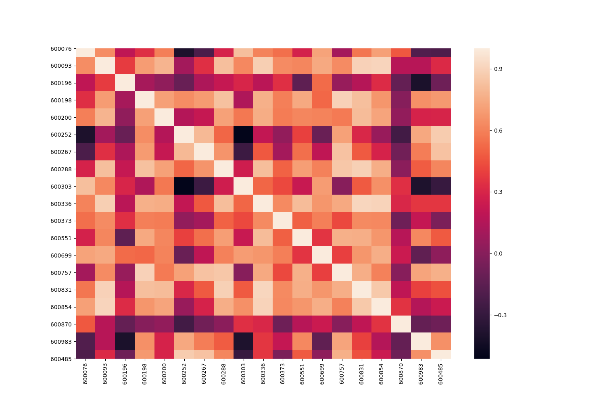

# Introduction

This repo is part of CS277 project: Deep Reinforcement Learning in Portfolio Management
The whole project consists three repos for three parts:
1. preprocessing:
    * Pre-stock-selection
    * Processing raw data provided by SSE
    * Generating datasets for DQN and DDPG based on the selected stocks
2. DQN:
    * Implement of trading agent based on DQN
3. DDPG:
    * Implement of trading agent based on DDPG

This repo is for preprocessing part.

# How to run
```python
python select_stock.py
```
This script will:
* concat the raw data files
* select 19 stocks randomly
* generate datasets files for DQN and DDPG 
* conduct correlation analysis and visualization for the 19 stocks 

# Structure
```python
.
|-data
    |-quot
|-vis
|-select_stock.py
|-stock_table.csv
|-stock_history.h5
|-all_set.csv
|-train_set.csv
|-test_set.csv
```
`/quot` folder is the data folder consists raw data provided by SSE.
Before running the `select_stock.py` script, please check that you have put the `/quot` folder under the `/data` folder.
`/vis` folder: Graphs and tables generated by `select_stock.py` on data visualization and correlation analysis.
`select_stock.py`: the main script.
Following are examples of outputs generated by running the `select_stock.py` script:
`stock_table.csv`: table of stocks selected by the `select_stock.py` script.
`all_set.csv`: the dataset file for DQN
`stock_history.h5`: the dataset file for DDPG
`train_set.csv`: the training set separated from all_set.csv for visualization and correlation analysis.
`test_set.csv`: the testing set separated from all_set.csv for visualization and correlation analysis.

# Output

## 19 Stocks we chose

stock_table: 19 stocks from different industry areas chose randomly.

## Correlation analysis of 19 stocks on train set

train_set_corr.csv: correlation data table 

19_stock_pct.png:  percentage(LastPx/PreClosePx) of every stock form 2014 to 2017


19_stock_raw.png: LastPx of every stock form 2014 to 2017


19_stock_heatmap.png: heatmap of 19 stocks which shows the correlation of every 2 stocks. 



19_tock_pairplot.png: pairplot graph of 19 stocks which shows the correlation of every 2 stocks.

 

## Data preprocess: Train set, Test set

train_set.csv:  LastPx (colse data) of 19 stocks form 2014-2017

test_set.csv:  LastPx (colse data) of 19 stocks form 2017-2019

all_set.csv: LastPx (colse data) of 19 stocks form 2014-2019

stock_history.h5: open, close, high, low, volume of 19 stocks from 2014-2019

