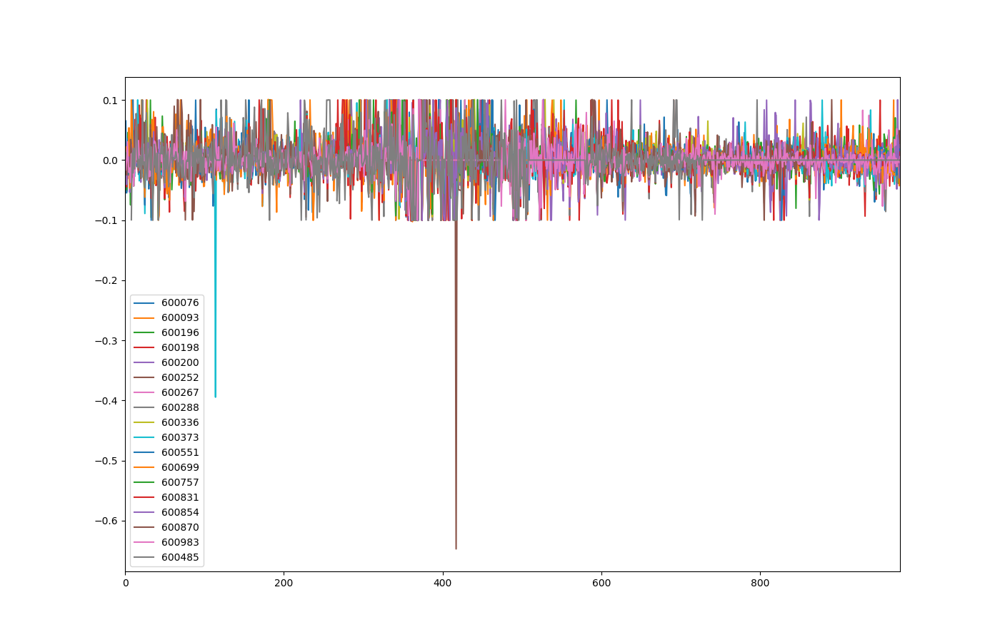
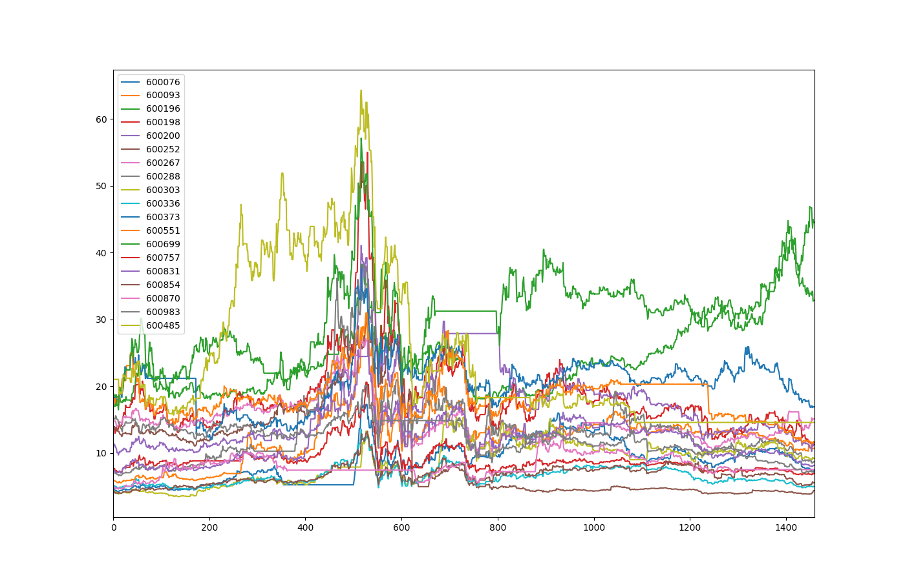
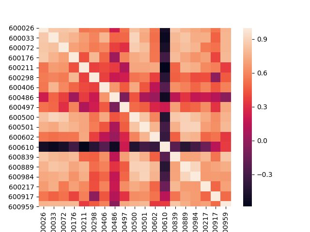

# Code

select_stock.py

# Data File

## 19 Stocks we chose

stock_table: 19 stocks from different industry areas chose randomly.

## Correlation analysis of 19 stocks on train set

train_set_corr.csv: correlation data table 

19_stock_pct.png:  percentage(LastPx/PreClosePx) of every stock form 2014 to 2017

19_stock_raw.png: LastPx of every stock form 2014 to 2017

19_stock_heatmap.png: heatmap of 19 stocks which shows the correlation of every 2 stocks. 

19_tock_pairplot.png: pairplot graph of 19 stocks which shows the correlation of every 2 stocks.

 

## Data preprocess: Train set, Test set

train_set.csv:  LastPx (colse data) of 19 stocks form 2014-2017

test_set.csv:  LastPx (colse data) of 19 stocks form 2017-2019

all_set: LastPx (colse data) of 19 stocks form 2014-2019

